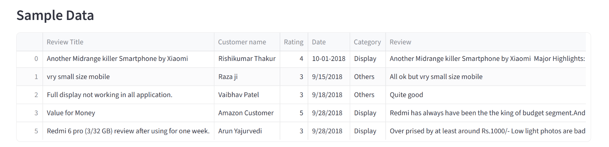
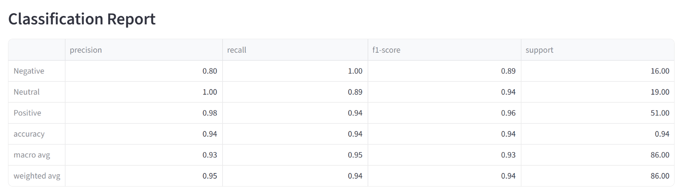
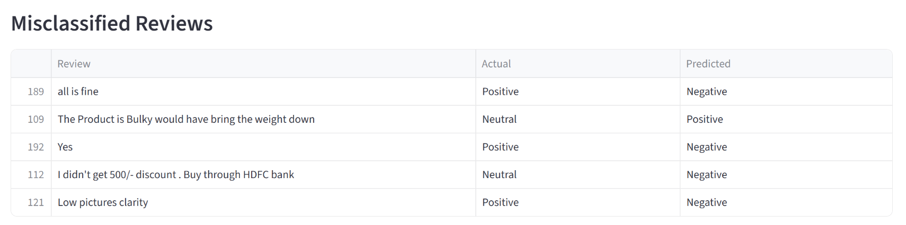
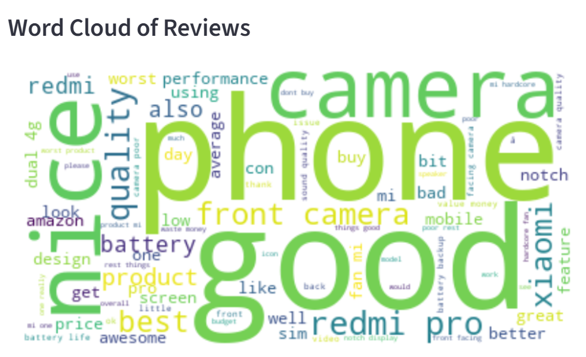
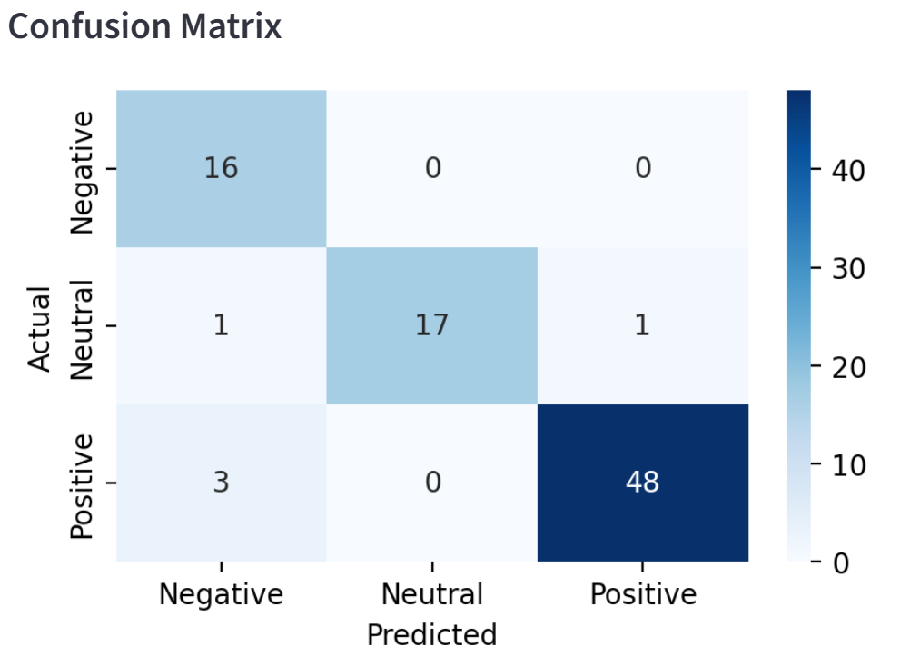
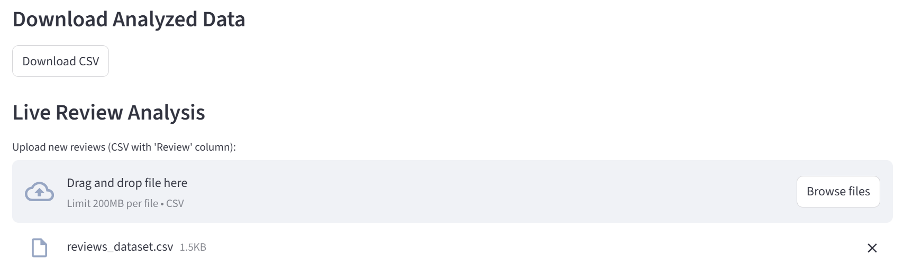
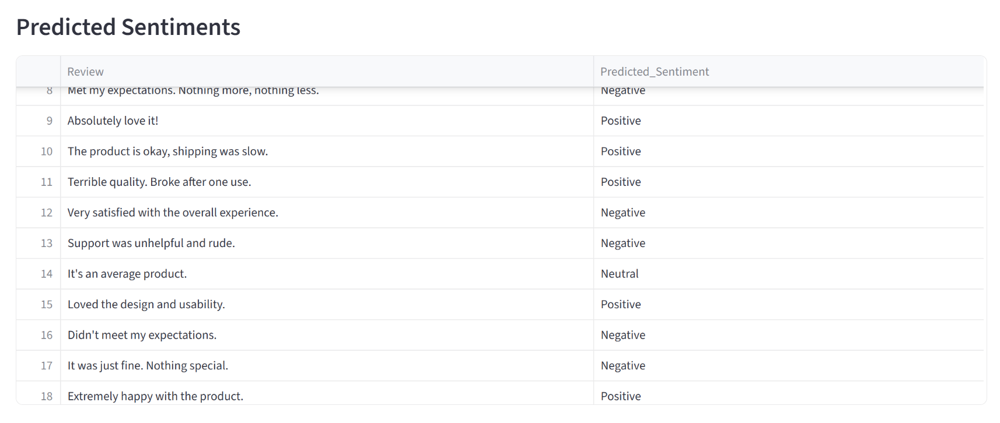
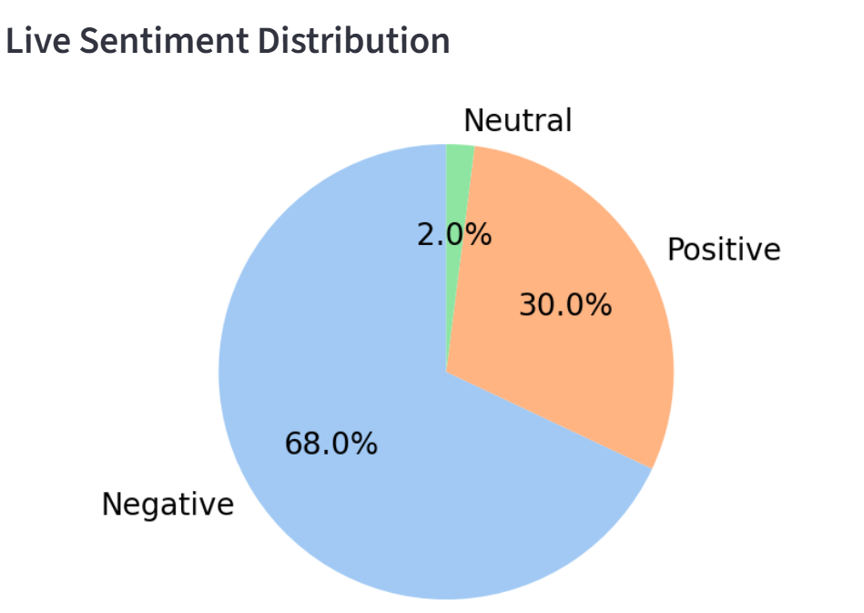

# 📊 Sentiment Analysis App  

An interactive and AI-powered Sentiment Analysis Web App built using **Streamlit, Scikit-learn, Pandas, Matplotlib, Seaborn, and NLTK**.
This app analyzes customer reviews and classifies them as **Positive, Neutral, or Negative**, using a trained machine learning model. It offers rich **visualizations, misclassification insights, and live review uploads**.


# 🚀 Live App

🔗 [Click here to use the live app](https://sentiment-analysis-using-ml-hu3wdj4pcj5aqncejpgpup.streamlit.app/)


## ✨ Features  

✔ Load and balance customer review data from a CSV file.

✔ AI-powered classification using **TF-IDF + Random Forest**.  

✔ Upload your own CSV files to predict sentiments in real time.

✔ Classify sentiments as **Positive, Neutral, or Negative**.  

✔ View classification reports, confusion matrices, and word clouds and explore misclassified reviews.

✔ **Light and dark theme** support.

✔ Download analyzed dataset in one click.


## 🖥️ Demo Screenshot  












## ⚡ Getting Started  

### 1️⃣ Clone the Repository  

```bash
git clone https://github.com/Hemalytica/sentiment-analysis-using-ML.git
cd sentiment-analysis-using-ML

2️⃣ Set Up a Virtual Environment (Optional, but Recommended)

python -m venv venv
source venv/bin/activate  # On Windows: venv\Scripts\activate

3️⃣ Install Dependencies

pip install -r requirements.txt

4️⃣ Run the Application

streamlit run app.py

The app will open in your browser automatically! 🎉

📂 Project Structure

📦 sentiment-analysis
┣ 📜 app.py               # Main Streamlit application
┣ 📂assets/            # Screenshots and demo images
┣ 📂 data/                # Sample CSV files
┣ 📜 requirements.txt      # Python dependencies
┣ 📜 README.md            # Project documentation

🚀 Future Enhancements

We have big plans for this project! Here’s what’s coming next:

✅ Sentiment trends over time
✅ Add speech-to-text input
✅ Add multilingual sentiment support
✅ Deploy on Hugging Face or Heroku for wider access

📜 License
This project is open-source under the MIT License.
Check the LICENSE file for more details.

📌 Uploading to GitHub
After adding your README.md, push it to GitHub:

git add README.md
git commit -m "Added README file"
git push origin main
Now, your README will be live on your GitHub repository! 🎉

🛠️ Tech Stack
Frontend: Streamlit
Backend: Python, Scikit-learn, NLTK
Libraries: Matplotlib, Seaborn, WordCloud
Data: User-uploaded & sample CSV files
